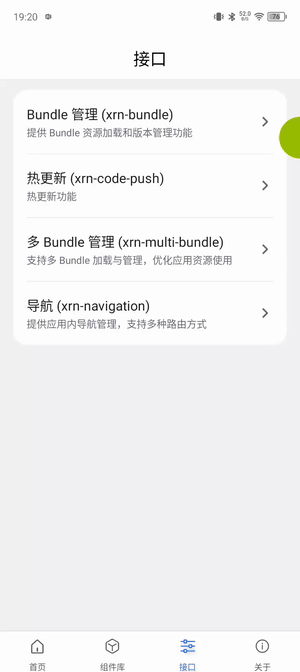
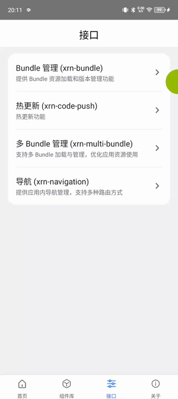

# XRN

[English](./README_EN.md) | 中文

XRN 是一个面向跨平台应用开发的 **React Native 一体化解决方案**，旨在为开发者提供统一的 **应用开发、构建、发布、依赖管理** 能力，并支持灵活的业务模块化扩展。

> 注意：当前仅支持在 macOS 上进行开发与构建（建议 macOS 13+，Xcode 15+，Node.js 18+）。Windows/Linux 暂未适配。

## ✨ 功能特性

- **跨平台支持**  
  支持 iOS、Android，以及 HarmonyOS Next（鸿蒙 Next）平台的应用开发与构建。

- **多Bundle架构**  
  支持主包 + 子包的多 Bundle 形态，按业务模块解耦拆分，独立开发、编译与按需下发，降低首包体积并提升迭代效率。

- **组件库**  
  内置常用 UI 组件与业务能力封装（导航、状态管理、资源加载等），支持按需引入与主题定制，提供示例应用便于快速上手。

- **统一依赖管理**  
  集成二方包管理、版本控制、依赖安全校验。

- **自动化发布流程**  
  支持多包发布、模板发布、热更新 (CodePush) 等能力。

- **CLI 工具集成**  
  提供开发辅助 CLI 工具，实现一键构建、发布、启动等操作。

- **文档与教程**  
  提供完整的 API 文档、平台开发指南和最佳实践。

## 🎥 演示视频

#### 应用创建、构建、启动的完整演示流程：

#### 多 Bundle

#### 热更新

#### 组件库

#### 跨 Bundle 导航

## 📥 Demo App 下载

前往仓库 Releases 页面获取最新 Demo 安装包：[Releases](https://github.com/xtransferorg/xrn/releases/)

## 📂 项目结构

| 目录/文件         | 说明 |
| ----------------- | ---- |
| `apps/`           | 应用示例或测试项目，主要用于本地调试和验证功能。 |
| `packages/`       | XRN 的核心与扩展模块源码，按功能拆分为多个 NPM 包。 |
| `docs/`           | 项目文档与教程的源码。 |
| `LICENSE`         | Apache 2.0 开源协议文本。 |
| `README.md`       | 项目介绍与使用说明（本文档）。 |

## 🛠️ 文档

详细文档请参见 [xrn](https://xtransferorg.github.io/xrn/) 

- [组件库](https://github.com/xtransferorg/xtd-rn)
- [热更新](https://github.com/xtransferorg/code-push)

## 🙋 交流与答疑

钉钉扫码加入答疑群：

微信或企业微信扫码加入答疑群：

## 📄 License

Copyright (c) 2025 XRN Contributors

Licensed under the Apache License, Version 2.0 (the "License");
you may not use this project except in compliance with the License.
You may obtain a copy of the License at:

[http://www.apache.org/licenses/LICENSE-2.0](http://www.apache.org/licenses/LICENSE-2.0)

Unless required by applicable law or agreed to in writing, software
distributed under the License is distributed on an "AS IS" BASIS,
WITHOUT WARRANTIES OR CONDITIONS OF ANY KIND, either express or implied.
See the License for the specific language governing permissions and
limitations under the License.
